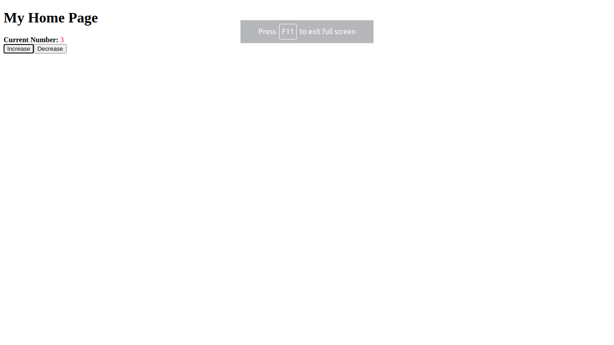

<!-- AUTO-GENERATED-CONTENT:START (STARTER) -->

  <h1>Gatsby Redux Demo</h1>

## Reference link
[Redux](https://redux.js.org/)

## Usage
1. Open terminal 
2. Install package management : `npm install`
3. Run application : `npm start`